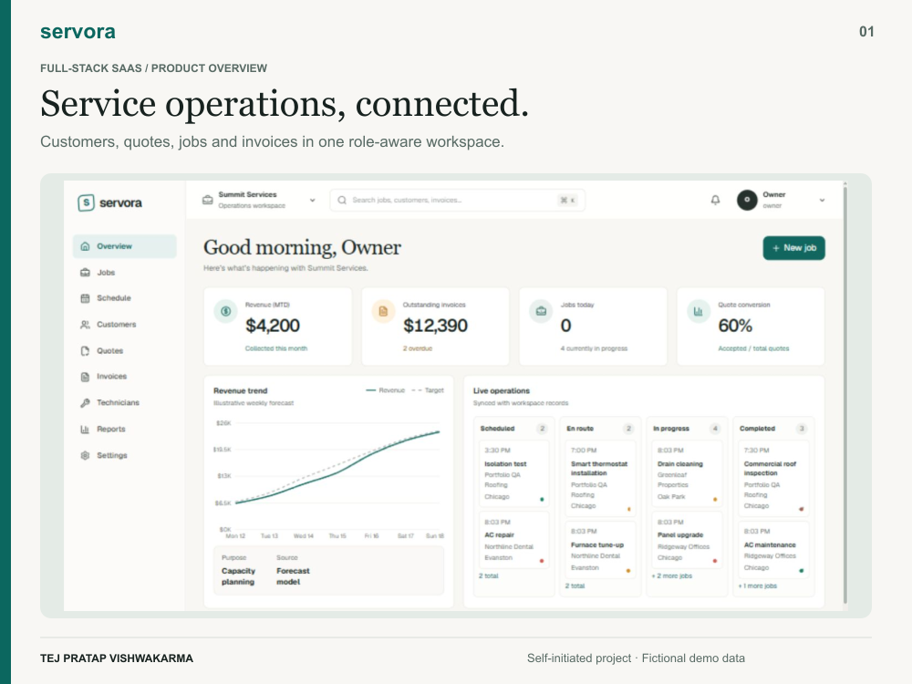
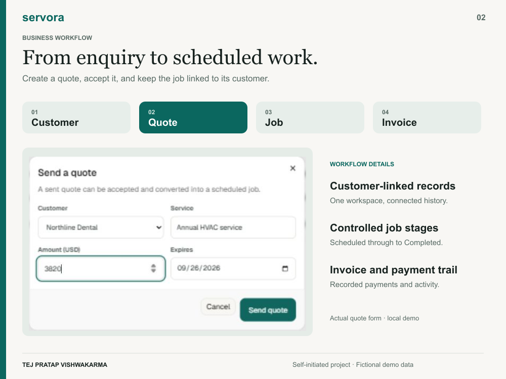
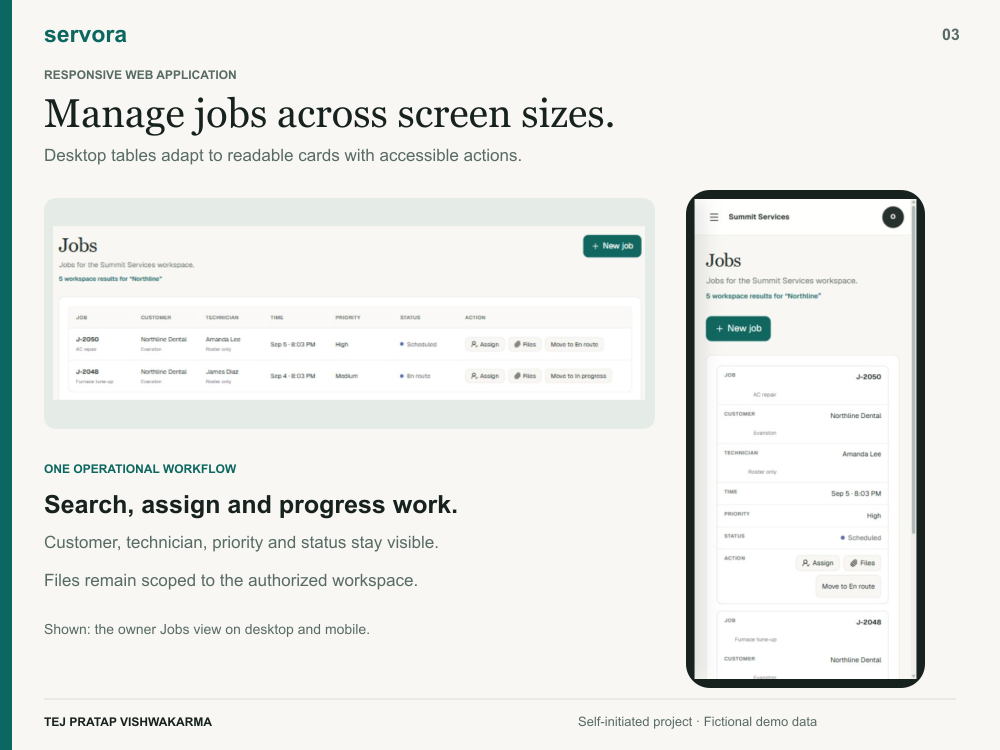
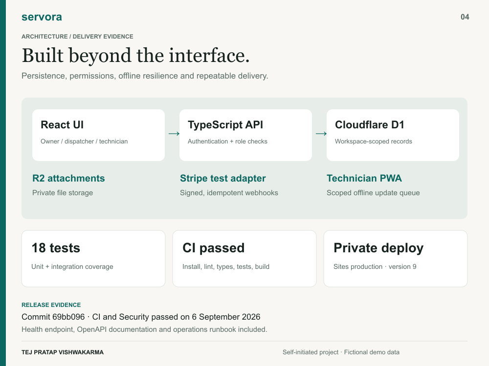
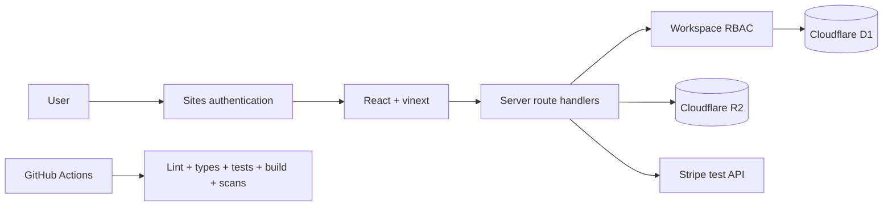

# Servora Operations SaaS

[](https://github.com/tejv0251/servora/actions/workflows/ci.yml)
[](https://github.com/tejv0251/servora/actions/workflows/security.yml)

Servora is a self-initiated, full-stack field-service operations product for HVAC,
plumbing, electrical, and cleaning teams. It turns the customer-to-payment workflow
into one role-aware workspace and demonstrates production-oriented React, API, data,
security, offline, and deployment work.

Live owner-only preview: <https://servora-operations-saas.tejvishwakarma.chatgpt.site>

> The hosted preview currently requires authorized Sites access. All names, contact
> details, jobs, and financial records shown by the application are fictional.

## Portfolio walkthrough



| Quote workflow | Responsive jobs |
|---|---|
|  |  |



These images use the working local application and fictional data. The mobile
capture shows the responsive owner Jobs view. Engineering evidence is dated
6 September 2026, release commit `69bb096`.

[Portfolio description and captions](docs/portfolio/UPWORK-ENTRY.md) ·
[90-second recording script](docs/portfolio/WALKTHROUGH-SCRIPT.md)

## Product capabilities

- Decision-ready dashboard with KPIs, revenue progress, schedule, and activity
- Persistent Customer → Quote → Job → Invoice → Payment workflow
- Owner, dispatcher, and technician roles with server-side authorization
- Seven-day invitations, role changes, revocation, and authenticated-email acceptance
- Account-based technician assignment and assigned-job-only field access
- Installable technician PWA with offline queueing and idempotent reconnect replay
- Tenant-scoped Cloudflare R2 work-order attachments
- Manual payment ledger and Stripe Checkout test-mode adapter
- Signed, time-bounded, amount-checked, idempotent Stripe webhooks
- Multi-workspace isolation and lifecycle regression tests
- Structured error logging, request correlation, health check, and security headers

## Technology

- React 19, TypeScript, vinext, Vite, and Tailwind CSS
- Base UI/shadcn primitives, Recharts, and Lucide icons
- Cloudflare D1 (SQLite) with Drizzle schema and generated migrations
- Cloudflare R2 for attachments
- Sites authentication and hosting
- Node test runner, oxlint, TypeScript, GitHub Actions, npm audit, and Gitleaks

## Architecture



See [docs/ARCHITECTURE.md](docs/ARCHITECTURE.md) for trust boundaries, storage,
offline behavior, and operational controls.

## Local setup

Requirements: Node.js 22.13 or newer and npm.

```bash
npm ci
npm run dev
```

The local Cloudflare runtime creates project-local D1/R2 state. Hosted identity is
not simulated automatically; integration tests use loopback-only test headers.

Optional Stripe test configuration is documented in `.env.example`. Live-mode keys
are rejected by the application.

## Verification

```bash
npm run check
npm run check:secrets
npm run audit:prod
```

`npm run check` runs lint, TypeScript validation, the automated test suite, and a
production build. GitHub repeats these gates for every push and pull request, while
the weekly Security workflow checks production dependencies and full Git history for
secrets.

## API and operations

- `GET /api/health` provides a non-sensitive D1 readiness check.
- Authenticated endpoints return `Cache-Control: no-store` and hardened response
  headers.
- Unexpected API failures emit structured JSON and return an `x-request-id` for
  support correlation.
- Deployment, rollback, backup, recovery, and incident guidance is in
  [docs/OPERATIONS.md](docs/OPERATIONS.md).
- The complete route inventory is published as
  [docs/openapi.yaml](docs/openapi.yaml).
- Test, browser, Lighthouse, and bundle evidence is summarized in
  [docs/QUALITY.md](docs/QUALITY.md).

## Security model

Every business query is scoped to the selected authenticated workspace. Role checks
are performed on the server; UI visibility is not treated as authorization. File
downloads validate D1 metadata and workspace/job access before reading R2. Payment
operations use replay protection and Stripe webhook verification.

See [SECURITY.md](SECURITY.md) for reporting and repository-handling guidance.

## Known limitations

- The portfolio deployment remains owner-only until a dedicated public demo identity
  and automated reset policy are approved.
- Stripe is intentionally test-mode only.
- Leads CRM, advanced quote line items, week-calendar conflict detection, refunds,
  and platform-admin tooling are roadmap features, not claimed functionality.
- D1/R2 backup schedules and edge abuse controls are configured outside this source
  repository and must be enabled for a client production environment.

## Authorship and license

This is a self-initiated portfolio project designed and implemented to demonstrate
end-to-end product delivery. It does not represent paid client work or fabricated
business outcomes. Source code is available under the [MIT License](LICENSE); package
and asset attribution is recorded in [THIRD_PARTY_NOTICES.md](THIRD_PARTY_NOTICES.md).
