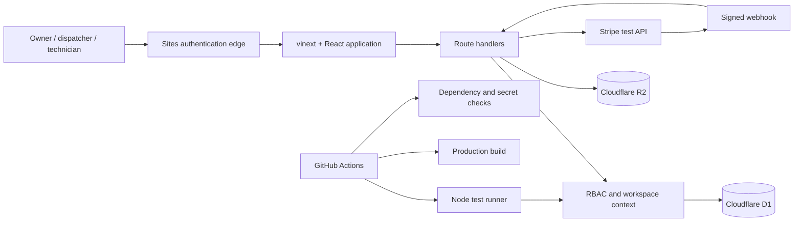

# Architecture

## Request boundary

Sites authenticates the visitor and supplies identity headers. `requireContext`
maps that identity to a membership, selects only a workspace the user belongs to,
and rejects roles that cannot perform the requested operation. Local identity
headers are accepted only on loopback hosts for deterministic integration tests.

## Data and storage

- D1 stores users, memberships, invitations, customers, quotes, jobs, assignments,
  notes, invoices, payments, idempotency records, and audit activity.
- Every business record carries a `workspace_id`; reads and writes include it in
  their predicates.
- R2 stores work-order attachments. Object keys include the workspace and job, and
  metadata is authorized through D1 before download.
- Stripe is test-mode only. Checkout and webhook operations use idempotency keys,
  signed event verification, amount checks, and duplicate-event protection.

## Resilience and operations

The technician PWA caches only static shell assets. Mutations queue in IndexedDB
with user/workspace scope and replay in order with idempotency keys. The health
route at `/api/health` checks D1 without exposing tenant data. API failures emit
single-line JSON logs with a request ID; responses return the same ID for support
correlation.
